[^^]:
素材库:new_project

## 新建工程

你可以选择在主界面选择新建.  
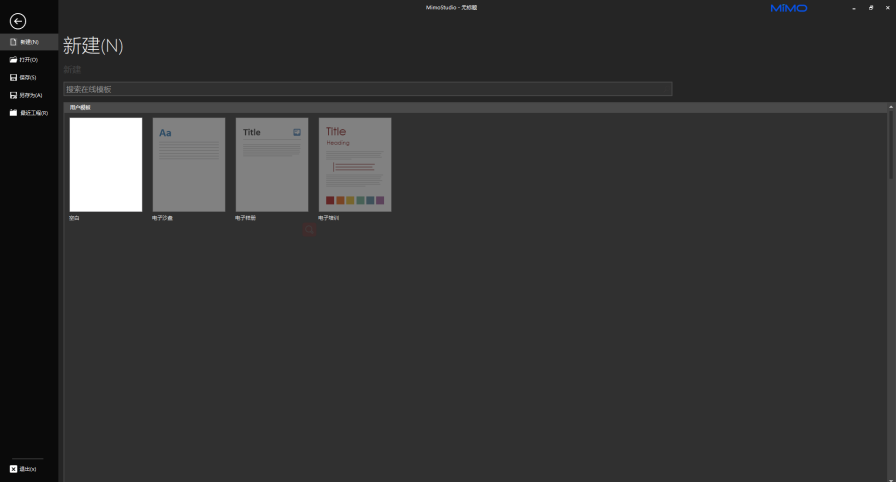  
选择空白即可进入新工程(如需使用其他模板请于[官网](https://n.mimovr.com)联系我司).  
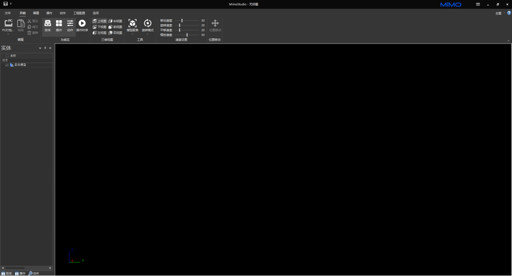

[^^]:
素材库:project_configuration

## 工程配置

##### 地板配置

首次进入会发现黑屏,需要先配置地板属性.  
1.通过上方找到菜单栏的工程配置.  
2.在工程配置里找到地面属性,点击显示单选按钮来显示地板.  
3.完成即可看见如下页面.  
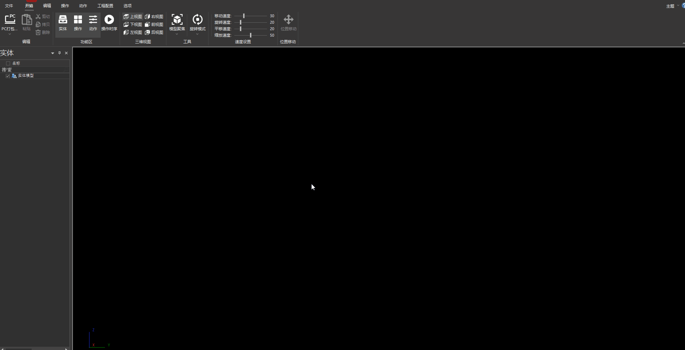

##### 地板属性配置

点击地面属性设置,我们可以设置地板大小以及颜色配置等.  
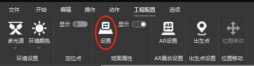  
可以设置长、宽、材质属性.  
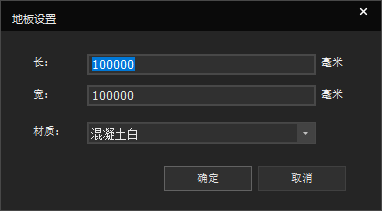  
确认即可看到设置好的地板.  
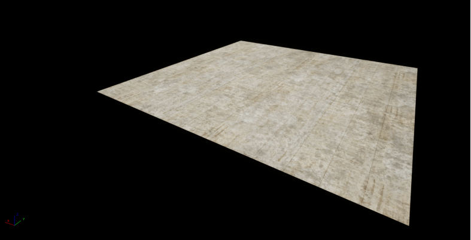

##### 环境配置

觉得环境颜色单调,可以选择配置环境.  
1.通过上方找到菜单栏的工程配置.  
2.在工程配置里找到环境颜色,点击想要的颜色.  
3.完成即可看见如下页面.  
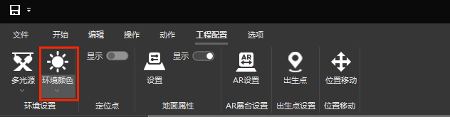  
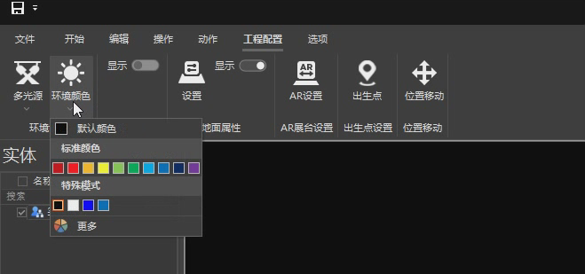  
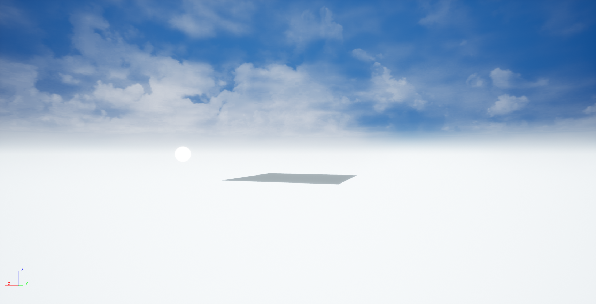

##### 主题配置

默认主题为黑色.  
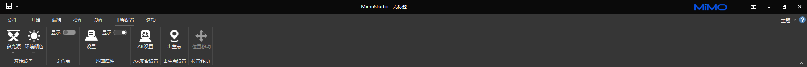  
右上角点击主题可以配置主题颜色.  
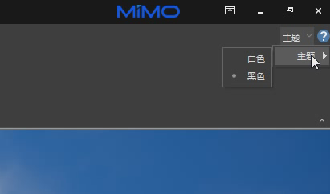  
选择白色主题.  
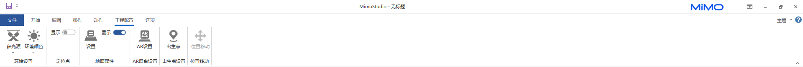

[^^]:
素材库:operating_instructions

## 操作说明

操作模式分为鸟瞰模式与旋转模式.

##### 旋转模式(默认)

鼠标滑轮向下放大缩小移动视角,按住鼠标右键可以旋转视角.
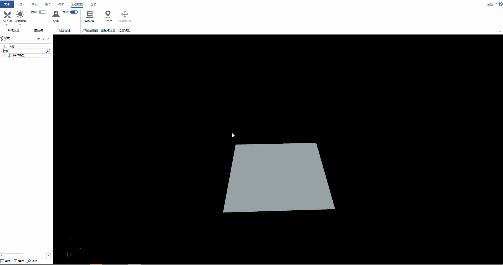

##### 鸟瞰模式

WSAD分别控制视角前后左右移动,按住鼠标右键可以旋转视角.
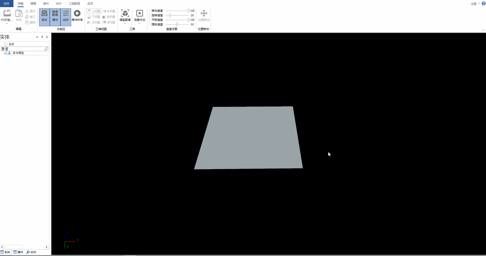  

