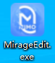
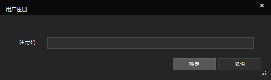
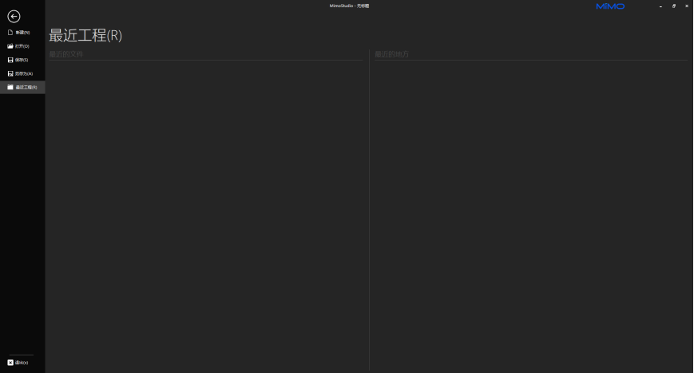

[^_^]:
素材库：none
## PC端软件安装
# 系统配置要求

Windows系统

|      |                                                               最低系统配置 |                   推荐系统配置                    |
|:-----|---------------------------------------------------------------------:|:-------------------------------------------:|
| 操纵系统 |                                                    Windows® 7 64-bit |             Windows® 10 64-bit              |
| 处理器  |                                Intel® Core™ i5-3450  AMD FX™ 8300 | Intel® Core™ i7-6700  AMD Ryzen™ 7 2700X |
| 内存   |                                4 GB （集成显卡（如Intel HD Graphics系列）为8GB） |                    8 GB                     |
| 储存空间 | 固态硬盘（SSD）100GB可用空间 或机械硬盘（HDD）100GB可用空间 （HDD对游戏体验的影响，取决于驱动器的性能） |             固态硬盘（SSD）100GB可用空间              |

[^_^]:
素材库:开始使用

## 开始使用

1.启动  
  
2.填写注册码注册(如需体验请在[官网](https://n.mimovr.com)申请使用)  
  
3.等待程序加载完成  
  
4.加载完毕进入主页面  
  
