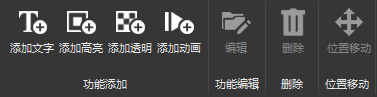
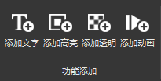
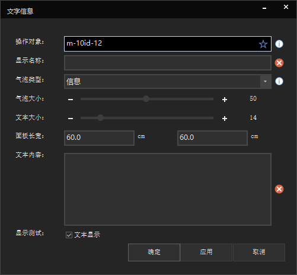
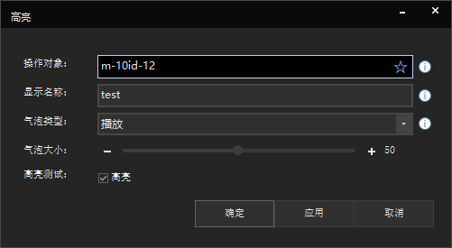
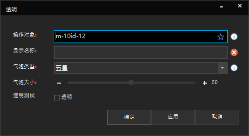
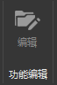

[^^]:
素材库:动作
## 动作
  
动作菜单栏主要功能有功能添加、功能编辑、删除、位置移动.  
## 功能添加
   
添加文字:   
添加文字可以在指定对象模型上添加选择的气泡类型与气泡大小,设置提示面板的长宽与提示文本信息.   
    
添加高亮:  
添加高亮可以在指定对象模型上添加选择的气泡类型与气泡大小,设置是否勾选高亮.    

添加透明:  
添加透明可以在指定对象模型上添加选择的气泡类型与气泡大小,设置是否勾选透明.   
   
添加动画:  
添加动画可以在指定对象模型上添加选择的气泡类型与气泡大小,设置对象的动画执行次数.   
   
## 功能编辑
  
可以编辑之前所创建的文字、高亮、动画等.
## 删除
可以删除之前所创建的文字、高亮、动画等.
