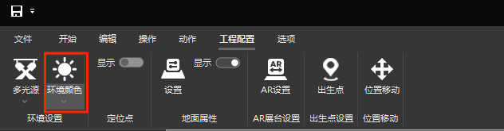
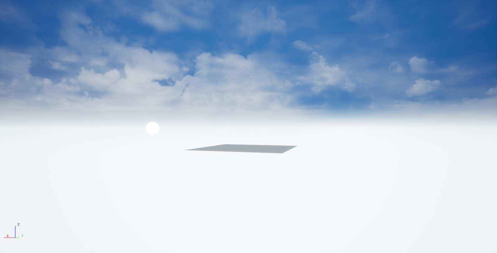
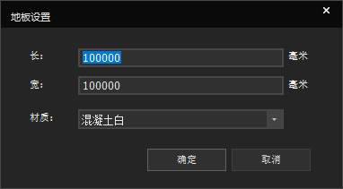
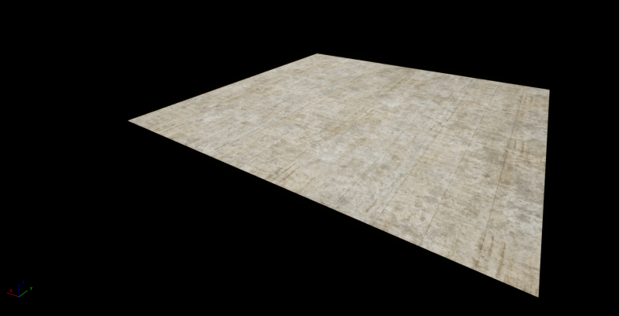

## 动作
  
## 环境设置  
  
###光源设置
多光源:  
    
单光源:  
    
### 环境颜色
觉得环境颜色单调,可以选择配置环境.  
1.通过上方找到菜单栏的工程配置.  
2.在工程配置里找到环境颜色,点击想要的颜色.  
3.完成即可看见如下页面.  
  
  
  
## 定位点
启动定位点会显示定位需要用到的二维码.  
      

##地面属性
##### 地板配置
1.通过上方找到菜单栏的工程配置.  
2.在工程配置里找到地面属性,点击显示单选按钮来显示地板.  
3.完成即可看见如下页面.  

##### 地板属性配置
点击地面属性设置,我们可以设置地板大小以及颜色配置等.  
  
可以设置长、宽、材质属性.  
  
确认即可看到设置好的地板.  
  
## 出生点设置

