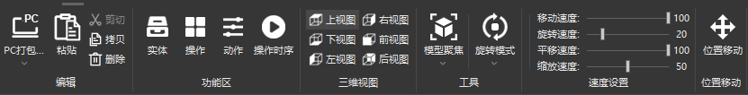

## 开始
开始菜单栏主要功能有编辑、功能区、三维视图、工具、速度设置、位置移动.

## 编辑
编辑主要分为打包、粘贴、剪切、拷贝、删除.

## 打包
打包分为PC打包、AR打包、VR打包、以及打包成ZIP  
  
PC打包可以将当前工程打包成PC可执行文件  
例如:  
这里我选择PC打包,设置打包的文件名.  
  
等待打包程序加载完成  
  
打包完成  
  
打包完成即可在打包路径路径下看见  
  
可以点击exe文件执行,等待文件加载完成.  
  
可以看到有自转以及拆解动画等功能.  
  
自转:  
  
拆解:  

## 拷贝
1.选择要拷贝的对象,然后点击拷贝图标即可拷贝  
  
2.选择要拷贝的对象,然后ctrl+C进行拷贝  
## 粘贴
1.选择要粘贴到的节点,点击粘贴即可将拷贝对象粘贴至选择的子节点下.   
  
粘贴完成后会出现clone的对象,区别是克隆的对象name属性会带有(copy),并且id也不相同.    
  
2.选择要粘贴到的节点,ctrl+v也可将拷贝对象粘贴至选择的子节点下.  
## 删除
点击需要删除的模型或者节点、即可删除对象.  
  
点击确定之后即可删除对象.  
## 功能区
