[^^]:
素材库:操作
## 操作
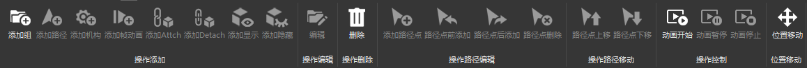  
大致功能区分为操作添加、操作编辑、操作删除、操作路径编辑、操作路径移动、操作控制、位置移动  
## 操作添加
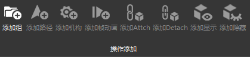  
添加组:  
点击添加组之后输入相关信息可以添加组。  
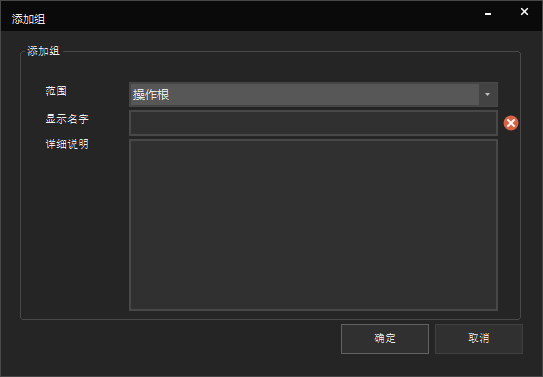  
添加路径:  
⑴添加路径首先必须得先有组!  
⑵其次指定要操作的模型  
⑶指定Frame点  
添加机构:
添加机构首先要有支持机构动画的模型文件，例如样本里有一个m-10id-12模型  
⑴我们先导入这个模型。  
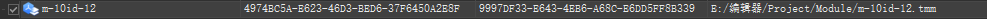   
⑵其次我们找到可以创建一个组。  
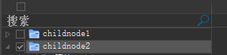   
⑶我们可以添加一个机构。  
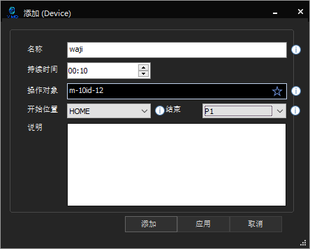   
添加完毕后可以看到时序图里有我们添加的机构动画了。   
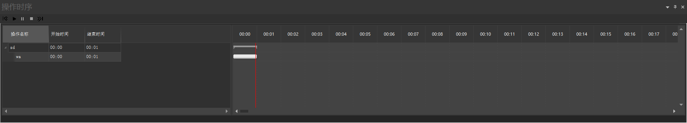   
## 添加帧动画
添加帧动画:  
添加帧动画可以将动画文件添加至操作时序里.  
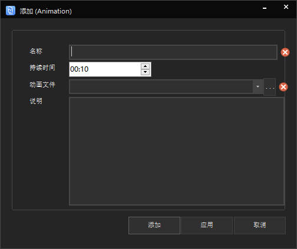   
## 添加Attch
添加Attch:  
添加Attch可以在操作时序播放时将父对象和子对象链接起来.  
## 添加Detach
添加Detach:  
添加Detach必须要先有Attch，可以解除将Attch链接的父子对象.  
## 添加显示
添加显示:  
添加显示可以在操作时序播放动画时在特定的时间段将添加的对象显示出来。  
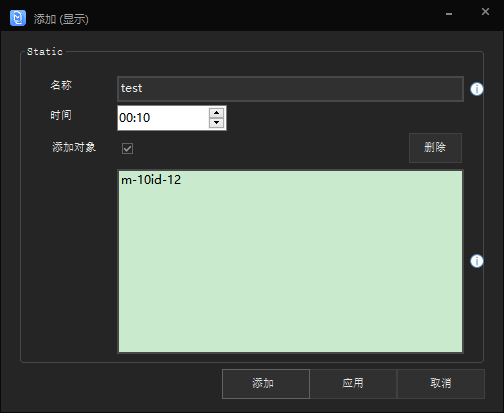  
## 添加隐藏  
添加隐藏:  
添加隐藏可以在操作时序播放动画时在特定的时间段将添加的对象隐藏起来。  
  

## 操作编辑
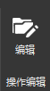  
操作编辑:  
可以编辑添加的组、路径、机构、帧动画、等等.  

## 操作删除
操作删除:  
删除添加的组、路径、机构、帧动画、等等.  

## 操作路径编辑
操作路径编辑:   
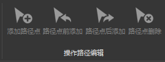  
添加路径点:    
添加路径点要先有路径.    
默认添加新路径点到最后,一个路径下可以添加多个路径点.添加完路径点之后需要调节路径点的位置.  
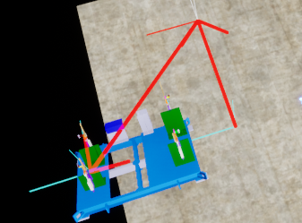  
可以看到图中的路径线之后我们就可以试播放动画了
路径点前添加：  
在当前选中节点之前添加新节点.  
路径点后添加：  
在当前选中节点之后添加新节点.  
删除路径点：  
将当前选中的路径点删除.   

## 操作路径移动
路径点上移:  
路径点上移可以跳转路径点位置.  
路径点下移:  
路径点下移可以跳转路径点位置.  

| 移动前 | 移动后 | 路径点移动前 | 路径点移动后 |
| :-: | :-: | :-: |  :-:|
| 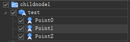  | 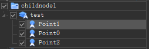 | 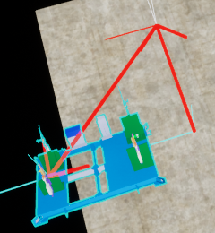  |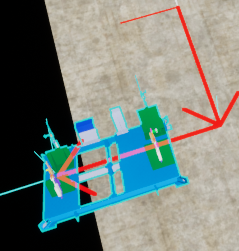 |

## 操作控制
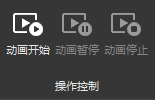  
动画开始:  
可以播放路径动画,机构动画,帧动画等.  
  
动画暂停:
可以将播放中的动画暂停.再次点击动画开始时,动画将继续开始播放.
动画停止:
可以将播放中的动画停止.再次点击动画开始时,动画将从头开始播放.

