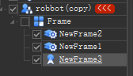

[^^]:
素材库:/编辑/实体
## 实体模型操作
初始界面只有实体模型.  
  
鼠标右击可以看见操作目录.  
  
##### 添加节点
我们可以添加节点.  
  
添加完毕.  
  
##### 添加模型
选中要添加的.tmm模型文件.  
  
添加完成,可以看到模型有名称,类型,标识,文件四个属性.  

| 名称 | 类型 | 标识 | 文件 |
| :-: | :-: | :-: |  :-:|
| 模型的名称  | 模型的类型(同种的模型类型一致)| 模型的唯一id |导入模型的地址|

   
同时可以看见模型已经成功导入进来.  
   
##### 修改模型、节点
修改节点可以修改当前选中的节点,也可以修改选中的模型  
  
修改节点完成之后,即可看见当前模型的名称已经发送变化  
  
##### 删除模型、节点
删除节点可以将不需要的模型、节点删除.  

[^^]:
素材库:/编辑
## 编辑
开始菜单栏主要功能有编辑状态、编辑、属性、设计软件导入、对齐、位置移动.  
  
## 编辑状态
  
进入编辑:进入编辑前需要先指定模型,进入编辑状态成功后可以看出模型的状态ui发送了变化.  
  
退出编辑:可以退出编辑模式.

## 编辑区
  
编辑区分为添加Frame点,和删除Frame点.  
添加Frame点:  
选中模型进入编辑模式就可以添加Frame点  
  
删除Frame点:  
选中Frame点可以删除单个Frame点,按住ctrl然后选中多个Frame点可以再删除Frame点可以删除多个Frame点  

## 属性
  
属性有Base点、Tool点、一般点.  
可以将生成的Frame点设置Base点、Tool点、一般点.
## 设计软件导入
  
开始连接:  
开启一个服务,可以连接PDPS、CATIA.  
布局导入:  
连接成功以后,点击布局导入可以将PDPS、CATIA的场景导入到MimoStudio当前场景之中.  
开始同步:  
场景导入完毕以后,点击开启同步之后,在PDPS、CATIA操作模型会在MimoStudio里也有同样的操作.
## 对齐
  
可以将PDPS、CATIA的场景与MimoStudio当前场景模型快速对齐.

