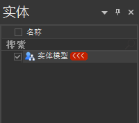
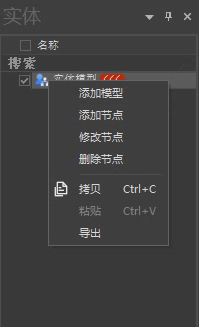
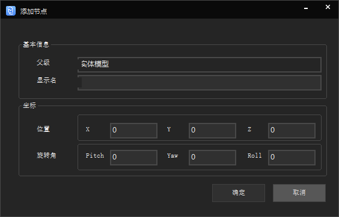
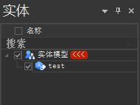
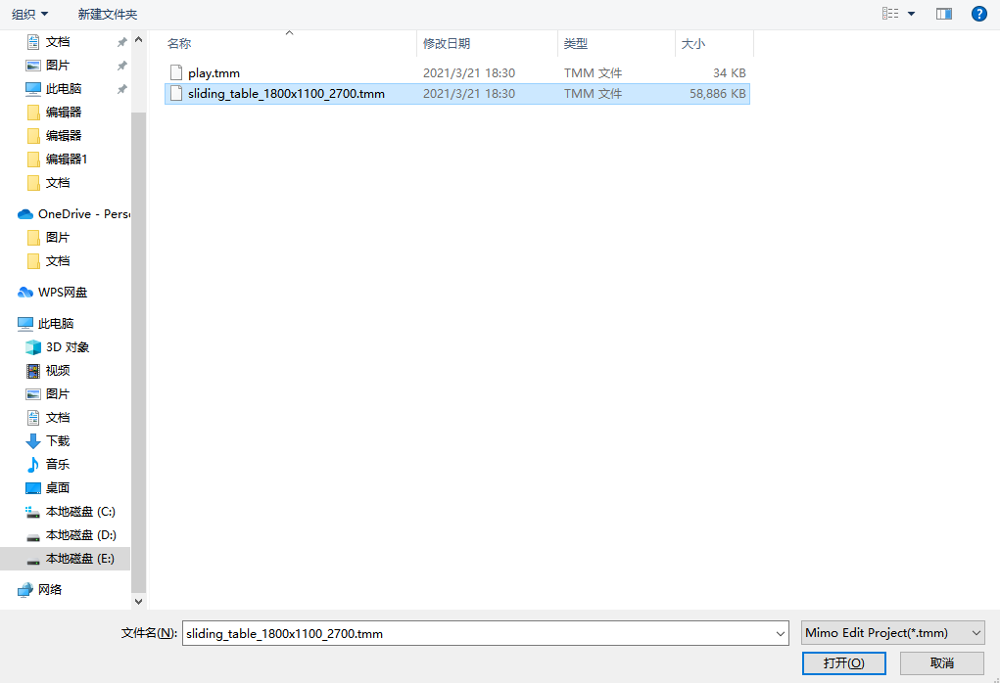
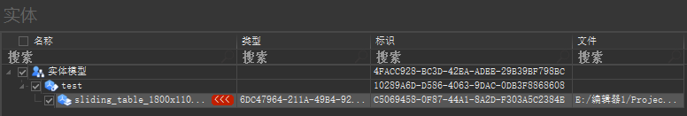
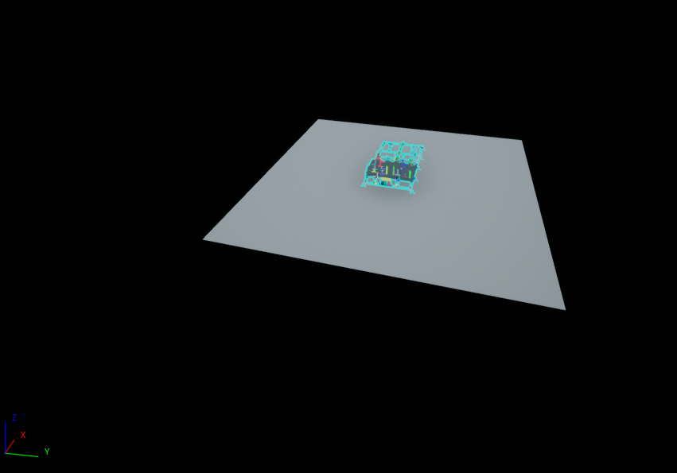
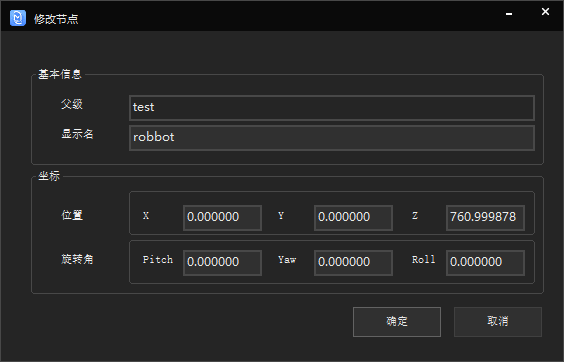
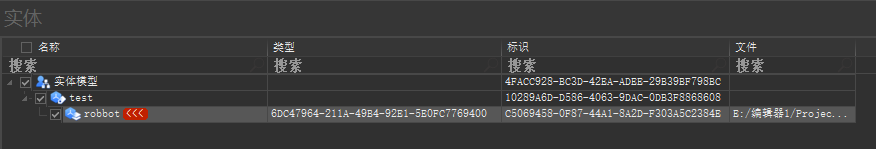

## 实体模型操作
初始界面只有实体模型.  
  
鼠标右击可以看见操作目录.  
  
##### 添加节点
我们可以添加节点.  
  
添加完毕.  
  
##### 添加模型
选中要添加的.tmm模型文件.  
  
添加完成,可以看到模型有名称,类型,标识,文件四个属性.  
名称:模型的名称.  
类型:识别模型类型,copy的模型模型类别一致.  
标识:模型的唯一id.  
文件:导入模型的地址.  
   
同时可以看见模型已经成功导入进来.  
   
修改节点可以修改当前选中的节点,也可以修改选中的模型  
  
修改节点完成之后,即可看见当前模型的名称已经发送变化
  

